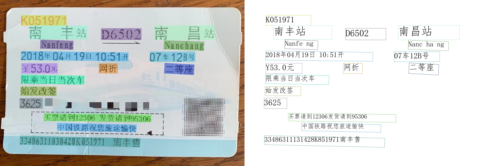
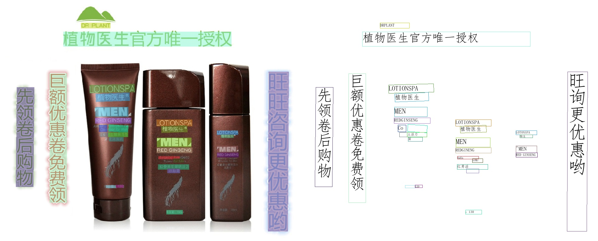
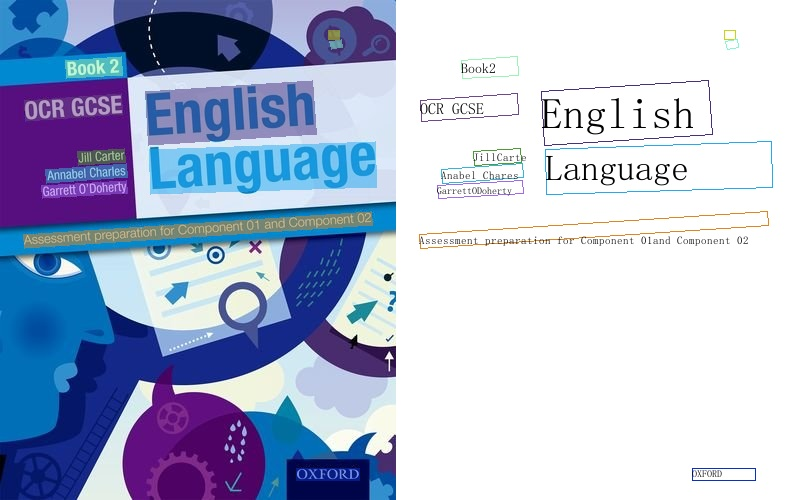
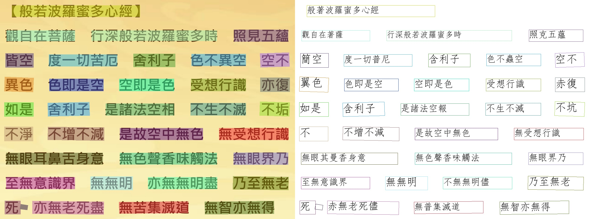
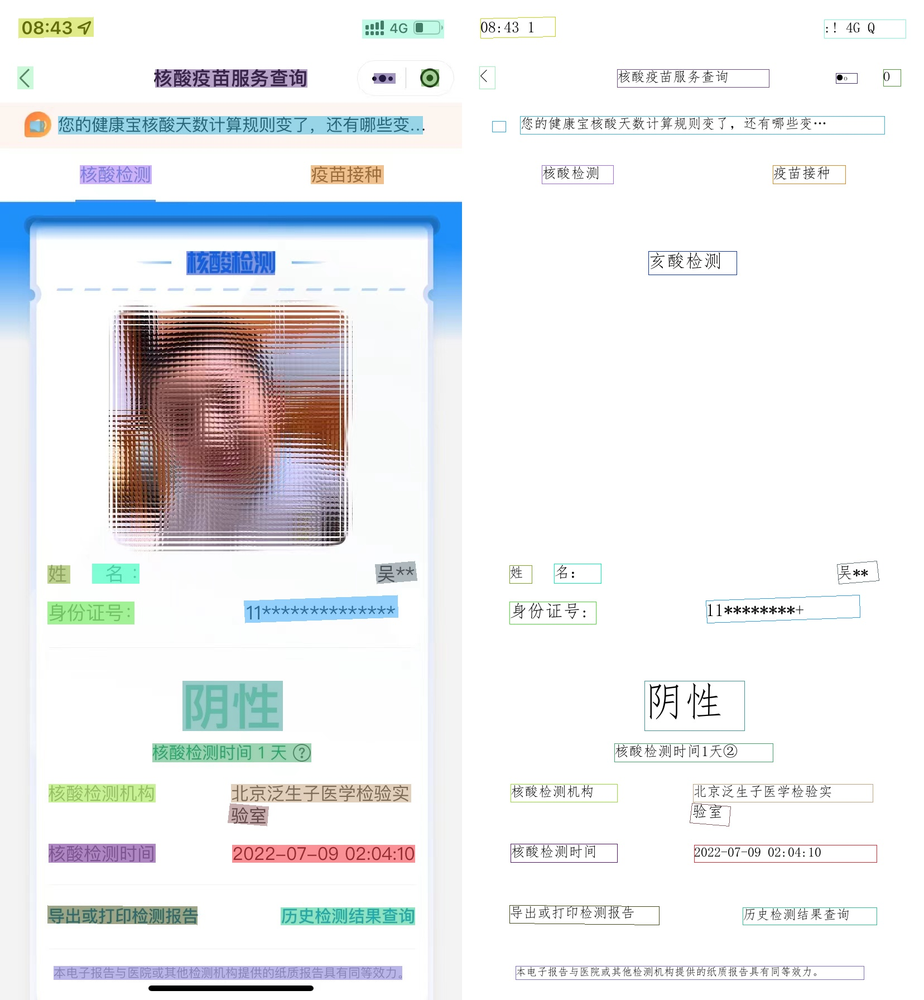
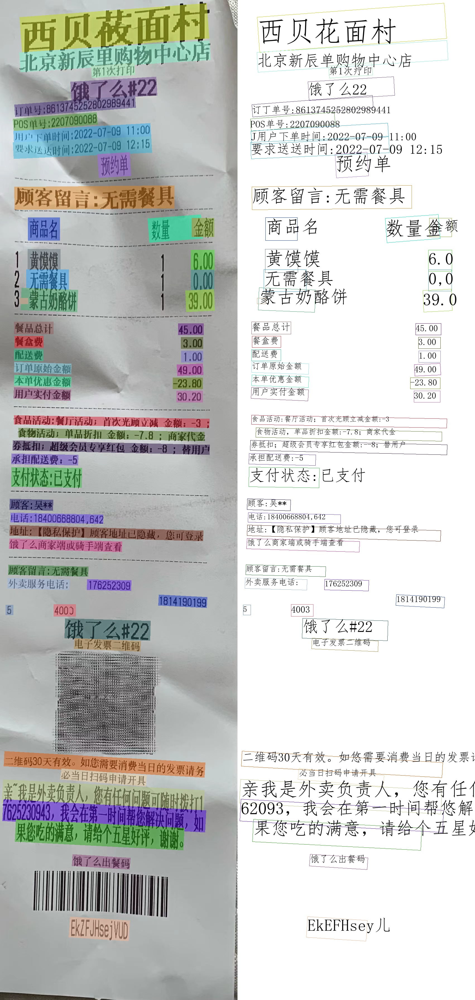

# 使用方法

## 模型文件自动下载

首次使用 **CnOCR** 时，系统会**自动下载** zip 格式的识别模型压缩文件，并存于 `~/.cnocr`目录（Windows下默认路径为 `C:\Users\<username>\AppData\Roaming\cnocr`）。
下载后的zip文件代码会自动对其解压，然后把解压后的模型相关目录放于`~/.cnocr/2.2`目录中。

如果系统无法自动成功下载zip文件，则需要手动从 **[cnstd-cnocr-models](https://huggingface.co/breezedeus/cnstd-cnocr-models/tree/main)** 下载此zip文件并把它放于 `~/.cnocr/2.2`目录。如果下载太慢，也可以从 [百度云盘](https://pan.baidu.com/s/1wvIjbjw95akE-h_o1HQd9w?pwd=nocr) 下载， 提取码为 ` nocr`。

检测模型的下载请参考 **[CnSTD 文档](https://github.com/breezedeus/CnSTD/tree/master#%E4%BD%BF%E7%94%A8%E6%96%B9%E6%B3%95)**。

放置好 zip 文件后，后面的事代码就会自动执行了。

## 详细使用说明

### 初始化

[类CnOcr](cnocr/cn_ocr.md) 是识别主类，包含了三个函数针对不同场景进行文字识别。类`CnOcr`的初始化函数如下：

```python
class CnOcr(object):
    def __init__(
        self,
        rec_model_name: str = 'densenet_lite_136-fc',
        *,
        det_model_name: str = 'ch_PP-OCRv3_det',
        cand_alphabet: Optional[Union[Collection, str]] = None,
        context: str = 'cpu',  # ['cpu', 'gpu', 'cuda']
        rec_model_fp: Optional[str] = None,
        rec_model_backend: str = 'onnx',  # ['pytorch', 'onnx']
        rec_vocab_fp: Union[str, Path] = VOCAB_FP,
        rec_more_configs: Optional[Dict[str, Any]] = None,
        rec_root: Union[str, Path] = data_dir(),
        det_model_fp: Optional[str] = None,
        det_model_backend: str = 'onnx',  # ['pytorch', 'onnx']
        det_more_configs: Optional[Dict[str, Any]] = None,
        det_root: Union[str, Path] = det_data_dir(),
        **kwargs,
    )
```

其中的几个参数含义如下：

* `rec_model_name`: 识别模型名称。默认为 `densenet_lite_136-fc`。更多可选模型见 [可直接使用的模型](models.md) 。

* `det_model_name`: 检测模型名称。默认为 `ch_PP-OCRv3_det`。更多可选模型见 [可直接使用的模型](models.md) 。

* `cand_alphabet`: 待识别字符所在的候选集合。默认为 `None`，表示不限定识别字符范围。取值可以是字符串，如 `"0123456789"`，或者字符列表，如 `["0", "1", "2", "3", "4", "5", "6", "7", "8", "9"]`。
	* `cand_alphabet`也可以初始化后通过类函数 `CnOcr.set_cand_alphabet(cand_alphabet)` 进行设置。这样同一个实例也可以指定不同的`cand_alphabet`进行识别。
* `context`：预测使用的机器资源，可取值为字符串`cpu`、`gpu`、`cuda:0`等。默认为 `cpu`。此参数仅在 `model_backend=='pytorch'` 时有效。

* `rec_model_fp`:  如果不使用系统自带的识别模型，可以通过此参数直接指定所使用的模型文件（`.ckpt` 或 `.onnx` 文件）。

* `rec_model_backend`：'pytorch', or 'onnx'。表明识别时是使用 `PyTorch` 版本模型，还是使用 `ONNX` 版本模型。 **同样的模型，ONNX 版本的预测速度一般是 PyTorch 版本的 2倍左右。** 默认为 'onnx'。

* `rec_vocab_fp`：识别字符集合的文件路径，即 `label_cn.txt` 文件路径。若训练的自有模型更改了字符集，看通过此参数传入新的字符集文件路径。

* `rec_more_configs`：`dict`，识别模型初始化时传入的其他参数。具体可参考 [Recognizer](cnocr/recognizer.md) 和 [PPRecognizer](cnocr/pp_recognizer.md) 中的 `__init__` 接口。
	
* `rec_root`:  识别模型文件所在的根目录。
	* Linux/Mac下默认值为 `~/.cnocr`，表示模型文件所处文件夹类似 `~/.cnocr/2.2/densenet_lite_136-fc`。
	* Windows下默认值为 `C:\Users\<username>\AppData\Roaming\cnocr`。
  
* `det_model_fp`:  如果不使用系统自带的检测模型，可以通过此参数直接指定所使用的模型文件（`.ckpt` 或 `.onnx` 文件）。

* `det_model_backend`：'pytorch', or 'onnx'。表明检测时是使用 `PyTorch` 版本模型，还是使用 `ONNX` 版本模型。 **同样的模型，ONNX 版本的预测速度一般是 PyTorch 版本的 2倍左右。** 默认为 'onnx'。

* `det_more_configs`： `dict`，识别模型初始化时传入的其他参数。具体可参考 [CnSTD 文档](https://github.com/breezedeus/cnstd)，或者相关的源代码 [CnSTD/CnStd](https://github.com/breezedeus/cnstd/blob/master/cnstd/cn_std.py) 。

* `det_root`:  检测模型文件所在的根目录。
	* Linux/Mac下默认值为 `~/.cnstd`，表示模型文件所处文件夹类似 `~/.cnstd/1.2/db_resnet18`。
	* Windows下默认值为 `C:/Users/<username>/AppData/Roaming/cnstd`。


每个参数都有默认取值，所以可以不传入任何参数值进行初始化：`ocr = CnOcr()`。

---

类`CnOcr`主要包含**三个主要函数**，下面分别说明。


### 1. 函数`CnOcr.ocr(img_fp)`

函数`CnOcr.ocr()`可以对任意包含文字的图片进行文字检测和识别，其中文字检测功能通过调用场景文字检测工具 **[CnSTD](https://github.com/breezedeus/cnstd)** 完成。

```python
    def ocr(
        self,
        img_fp: Union[str, Path, Image.Image, torch.Tensor, np.ndarray],
        rec_batch_size=1,
        return_cropped_image=False,
        **det_kwargs,
    ) -> List[Dict[str, Any]]:
```


**函数说明**：

- 输入参数 `img_fp`: 对应一张图片，
	- 可以是需要识别的图片文件路径；
	- 或者由 `Image.open()` 导入的 `Image.Image` 类型；
	- 或者是已经从图片文件中读入的数组，类型可以为 `torch.Tensor` 或  `np.ndarray`，取值应该是`[0，255]`的整数，维数应该是 `[height, width]` （灰度图片）或者 `[height, width, channel]`，`channel` 可以等于`1`（灰度图片）或者`3`（`RGB`格式的彩色图片）。

- 输入参数 `rec_batch_size`：文字识别时可以批量进行，此值表示每次批量识别多少个文本框中的文字，默认值为 `1`；
- 输入参数 `return_cropped_image`：返回结果中是否返回检测出的文本框图片数据；
- `**det_kwargs`：可以为文本检测模型传入参数值，主要包含以下值：
	- `resized_shape`: `int` or `tuple`, `tuple` 含义为 `(height, width)`, `int` 则表示高宽都为此值；
			检测前，先把原始图片resize到接近此大小（只是接近，未必相等）。默认为 `(768, 768)`。
			注：这个取值对检测结果的影响较大，可以针对自己的应用多尝试几组值，再选出最优值。
				例如 `(512, 768)`, `(768, 768)`, `(768, 1024)` 等。
	- `preserve_aspect_ratio`: 对原始图片resize时是否保持高宽比不变。默认为 `True`。
	- `min_box_size`: 如果检测出的文本框高度或者宽度低于此值，此文本框会被过滤掉。默认为 `8`，也即高或者宽低于 `8` 的文本框会被过滤去掉。
	- `box_score_thresh`: 过滤掉得分低于此值的文本框。默认为 `0.3`。
	- `batch_size`: 待处理图片很多时，需要分批处理，每批图片的数量由此参数指定。默认为 `20`。
- **返回值**：`List[Dict]`，其中的每个元素存储了对一行文字的识别结果，包含以下 `key` ：
	- `text` (`str`): 识别出的文本
	- `score` (`float`): 识别结果的得分（置信度），取值范围为 `[0, 1]`；得分越高表示越可信
	- `position` (`np.ndarray` or `None`): 检测出的文字对应的矩形框；`np.ndarray`, shape: `(4, 2)`，对应 box 4个点的坐标值` (x, y)` ;
			注：此值只有使用检测模型时才会存在，未使用检测模型（`det_model_name=='naive_det'`）时无此值
	- `cropped_img` (`np.ndarray`): 当 `return_cropped_image==True` 时才会有此值。
			对应 `position` 中被检测出的图片（RGB格式），会把倾斜的图片旋转为水平。
			`np.ndarray` 类型，shape: ` (height, width, 3)`, 取值范围：`[0, 255]`；
	- 示例：
	  ```python
	   [{'position': array([[ 31.,  28.],
	         [511.,  28.],
	         [511.,  55.],
	         [ 31.,  55.]], dtype=float32),
	     'score': 0.8812797665596008,
	     'text': '第一行'},
	    {'position': array([[ 30.,  71.],
	          [541.,  71.],
	          [541.,  97.],
	          [ 30.,  97.]], dtype=float32),
	     'score': 0.859879732131958,
	     'text': '第二行'},
	    {'position': array([[ 28., 110.],
	          [541., 111.],
	          [541., 141.],
	          [ 28., 140.]], dtype=float32),
	     'score': 0.7850906848907471,
	     'text': '第三行'}
	   ]
	  ```


### 2. 函数`CnOcr.ocr_for_single_line(img_fp)`

如果明确知道要预测的图片中只包含了单行文字，可以使用函数`CnOcr.ocr_for_single_line(img_fp)`进行识别。和 `CnOcr.ocr()`相比，`CnOcr.ocr_for_single_line()`结果可靠性更强，因为它不需要做额外的分行处理。

```python
    def ocr_for_single_line(
        self, img_fp: Union[str, Path, torch.Tensor, np.ndarray]
    ) -> Dict[str, Any]:
```

**函数说明**：

- 输入参数 `img_fp`: 对应一张图片，
	- 可以是需要识别的图片文件路径（如下例）；
	- 或者是已经从图片文件中读入的数组，类型可以为 `torch.Tensor` 或  `np.ndarray`，取值应该是`[0，255]`的整数，维数应该是 `[height, width]` （灰度图片）或者 `[height, width, channel]`，`channel` 可以等于`1`（灰度图片）或者`3`（`RGB`格式的彩色图片）。
- **返回值**：为一个`dict`，对应一行文字的识别结果，包含以下 `key` ：
	- `text` (`str`): 识别出的文本
	- `score` (`float`): 识别结果的得分（置信度），取值范围为 `[0, 1]`；得分越高表示越可信
	- 示例：
	```python
		{'score': 0.8812797665596008,
		 'text': '当前行'}
	```

**调用示例**：

```python
from cnocr import CnOcr

ocr = CnOcr()
res = ocr.ocr_for_single_line('examples/rand_cn1.png')
print("Predicted Chars:", res)
```

或：

```python
from cnocr import CnOcr, read_img

ocr = CnOcr()
img_fp = 'examples/rand_cn1.png'
img = read_img(img_fp)
res = ocr.ocr_for_single_line(img)
print("Predicted Chars:", res)
```


### 3. 函数`CnOcr.ocr_for_single_lines(img_list, batch_size=1)`

函数`CnOcr.ocr_for_single_lines(img_list)`可以**对多个单行文字图片进行批量预测**。函数`CnOcr.ocr(img_fp)`和`CnOcr.ocr_for_single_line(img_fp)`内部其实都是调用的函数`CnOcr.ocr_for_single_lines(img_list)`。

```python
    def ocr_for_single_lines(
        self,
        img_list: List[Union[str, Path, torch.Tensor, np.ndarray]],
        batch_size: int = 1,
    ) -> List[Dict[str, Any]]:
```

**函数说明**：

- 输入参数` img_list`: 为一个图片 `list`；其中每个元素
	- 可以是需要识别的图片文件路径（如下例）；
	- 或者是已经从图片文件中读入的数组，类型可以为 `torch.Tensor` 或  `np.ndarray`，取值应该是`[0，255]`的整数，维数应该是 `[height, width]` （灰度图片）或者 `[height, width, channel]`，`channel` 可以等于`1`（灰度图片）或者`3`（`RGB`格式的彩色图片）。
- 输入参数 `batch_size`: 待处理图片很多时，需要分批处理，每批图片的数量由此参数指定。默认为 `1`。
- **返回值**：`List[Dict]`，其中的每个元素存储了对一行文字的识别结果，包含以下 `key` ：
	- `text` (`str`): 识别出的文本
	- `score` (`float`): 识别结果的得分（置信度），取值范围为 `[0, 1]`；得分越高表示越可信
	- 示例：
	  ```python
      [{'score': 0.8812797665596008,
        'text': '第一行'},
       {'score': 0.859879732131958,
        'text': '第二行'},
       {'score': 0.7850906848907471,
        'text': '第三行'}
      ]
	  ```

**调用示例**：

```python
import numpy as np

from cnocr import CnOcr, read_img, line_split

ocr = CnOcr()
img_fp = 'examples/multi-line_cn1.png'
img = read_img(img_fp)
line_imgs = line_split(np.squeeze(img, -1), blank=True)
line_img_list = [line_img for line_img, _ in line_imgs]
res = ocr.ocr_for_single_lines(line_img_list)
print("Predicted Chars:", res)
```

更详细的使用方法，可参考 [tests/test_cnocr.py](https://github.com/breezedeus/cnocr/blob/master/tests/test_cnocr.py) 中提供的测试用例。


## 各种场景的调用示例

### 常见的图片识别

所有参数都使用默认值即可。如果发现效果不够好，多调整下各个参数看效果，最终往往能获得比较理想的精度。

```python
from cnocr import CnOcr

img_fp = './docs/examples/huochepiao.jpeg'
ocr = CnOcr()  # 所有参数都使用默认值
out = ocr.ocr(img_fp)

print(out)
```

识别结果：

<figure markdown>
{: style="width:700px"}
</figure>


### 排版简单的印刷体截图图片识别

针对 **排版简单的印刷体文字图片**，如截图图片，扫描件图片等，可使用 `det_model_name='naive_det'`，相当于不使用文本检测模型，而使用简单的规则进行分行。

使用 `det_model_name='naive_det'` 的最大优势是**速度快**，劣势是对图片比较挑剔。如何判断是否该使用此检测模型呢？最简单的方式就是拿应用图片试试效果，效果好就用，不好就不用。

```python
from cnocr import CnOcr

img_fp = './docs/examples/multi-line_cn1.png'
ocr = CnOcr(det_model_name='naive_det') 
out = ocr.ocr(img_fp)

print(out)
```

识别结果：

<figure markdown>

| 图片                                                         | OCR结果                                                      |
| ------------------------------------------------------------ | ------------------------------------------------------------ |
|  | 网络支付并无本质的区别，因为<br />每一个手机号码和邮件地址背后<br />都会对应着一个账户--这个账<br />户可以是信用卡账户、借记卡账<br />户，也包括邮局汇款、手机代<br />收、电话代收、预付费卡和点卡<br />等多种形式。 |

</figure>


### 竖排文字识别

采用来自 [**PaddleOCR**](https://github.com/PaddlePaddle/PaddleOCR)（之后简称 **ppocr**）的中文识别模型 `rec_model_name='ch_PP-OCRv3'` 进行识别。

```python
from cnocr import CnOcr

img_fp = './docs/examples/shupai.png'
ocr = CnOcr(rec_model_name='ch_PP-OCRv3')
out = ocr.ocr(img_fp)

print(out)
```

识别结果：
<figure markdown>
{: style="width:750px"}
</figure>


### 英文识别

虽然中文检测和识别模型也能识别英文，但**专为英文文字训练的检测器和识别器往往精度更高**。如果是纯英文的应用场景，建议使用来自 **ppocr** 的英文检测模型 `det_model_name='en_PP-OCRv3_det'`， 和英文识别模型 `rec_model_name='en_PP-OCRv3'` 。

```python
from cnocr import CnOcr

img_fp = './docs/examples/en_book1.jpeg'
ocr = CnOcr(det_model_name='en_PP-OCRv3_det', rec_model_name='en_PP-OCRv3')
out = ocr.ocr(img_fp)

print(out)
```

识别结果：

<figure markdown>
{: style="width:670px"}
</figure>


### 繁体中文识别

采用来自ppocr的繁体识别模型 `rec_model_name='chinese_cht_PP-OCRv3'` 进行识别。

```python
from cnocr import CnOcr

img_fp = './docs/examples/fanti.jpg'
ocr = CnOcr(rec_model_name='chinese_cht_PP-OCRv3')  # 识别模型使用繁体识别模型
out = ocr.ocr(img_fp)

print(out)
```

使用此模型时请注意以下问题：

* 识别精度一般，不是很好；

* 除了繁体字，对标点、英文、数字的识别都不好；

* 此模型不支持竖排文字的识别。

识别结果：

<figure markdown>
{: style="width:700px"}
</figure>


### 单行文字的图片识别

如果明确知道待识别的图片是单行文字图片（如下图），可以使用类函数 `CnOcr.ocr_for_single_line()` 进行识别。这样就省掉了文字检测的时间，速度会快一倍以上。

<figure markdown>
{: style="width:270px"}
</figure>

调用代码如下：

```python
from cnocr import CnOcr

img_fp = './docs/examples/helloworld.jpg'
ocr = CnOcr()
out = ocr.ocr_for_single_line(img_fp)
print(out)
```


### 更多应用示例

* **核酸疫苗截图识别**
	<figure markdown>
	{: style="width:600px"}
	</figure>

* **身份证识别**
	<figure markdown>
	{: style="width:700px"}
	</figure>

* **饭店小票识别**
	<figure markdown>
	{: style="width:550px"}
	</figure>


